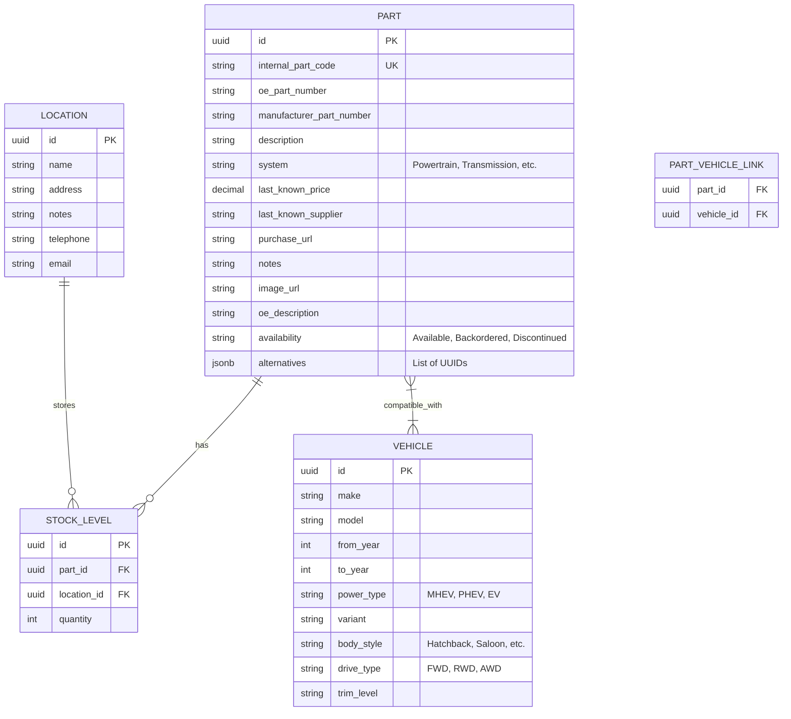

# Design Document: EPIC-001 Parts and Vehicles

## 1. Overview
This document describes the technical design for the Parts and Vehicles management system. The system follows a **Modular Monolith** architecture, implemented in Python using **FastAPI** and **PostgreSQL**.

## 2. Architectural Design
The system is organized as a discrete module within the `parts_service`.

### Module Structure (Clean Architecture Lite)
- `src/backend/parts/`: Root of the parts and vehicles module.
    - `api/v1/`: FastAPI routers and endpoints.
    - `core/`: Business logic, services (e.g., `PartService`, `VehicleService`).
    - `db/`: SQLModel/SQLAlchemy models and Alembic migrations.
    - `schemas/`: Pydantic models for API request/response validation.

## 3. Data Model
We use PostgreSQL as the primary relational database.

## 4. API Design
All endpoints are prefixed with `/api/v1`.

### Endpoints Summary
| Method | Path | Description | Auth Required |
| :--- | :--- | :--- | :--- |
| `GET` | `/api/v1/parts` | List all parts | No |
| `POST` | `/api/v1/parts` | Create a new part | Yes (JWT) |
| `GET` | `/api/v1/parts/{id}` | Get part details | No |
| `PATCH` | `/api/v1/parts/{id}` | Update a part | Yes (JWT) |
| `DELETE` | `/api/v1/parts/{id}` | Delete a part | Yes (JWT) |
| `GET` | `/api/v1/vehicles` | List all vehicles | No |
| `POST` | `/api/v1/vehicles` | Create a new vehicle | Yes (JWT) |
| `POST` | `/api/v1/parts/{id}/vehicles/{vid}` | Link part to vehicle | Yes (JWT) |
| `DELETE` | `/api/v1/parts/{id}/vehicles/{vid}` | Unlink part from vehicle | Yes (JWT) |
| `GET` | `/api/v1/search` | Free text search | No |

### Error Handling
Backend will return **RFC 7807** compliant error responses.

## 5. Search Implementation
Free text search will be implemented using PostgreSQL's **Full Text Search** and **`pg_trgm`** for fuzzy matching.
- A combined `tsvector` column or a dynamically generated one will be used for searching across multiple fields (Description, Part Number, Make, Model, etc.).
- `ts_rank` will be used for sorting by relevance as per US-021.

## 6. Authentication & Security
- **JWT**: Required for all mutations (POST, PUT, PATCH, DELETE).
- **Embedded Token**: For the initial phase, a pre-generated "Development JWT" will be included in the Frontend environment variables/config to satisfy API requirements without a login flow.
- **Middleware**: A FastAPI dependency or middleware will verify the presence and validity of the JWT for protected routes.

## 7. Non-Functional Requirements
- **Performance**: Search optimization via GIN indexes on `tsvector` and `trgm` columns.
- **UK English**: All schema names, log messages, and internal documentation use UK English (e.g., `honour`, `colour`, `standardise`).
- **Data Integrity**: Foreign key constraints for `STOCK_LEVEL` and `PART_VEHICLE_LINK`. Cascading deletes where appropriate.
